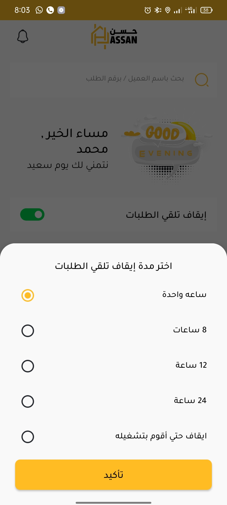
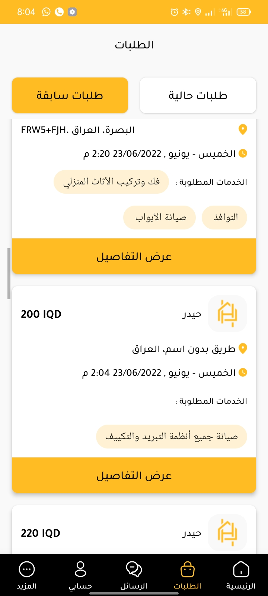
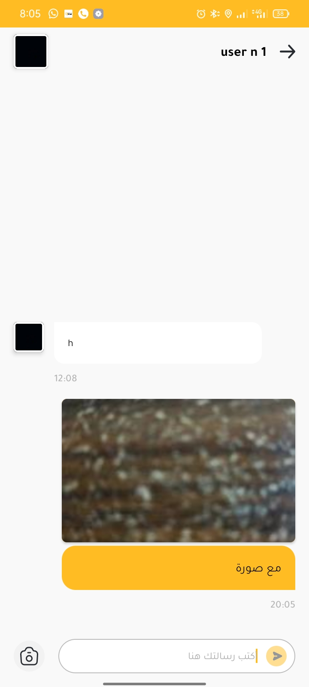
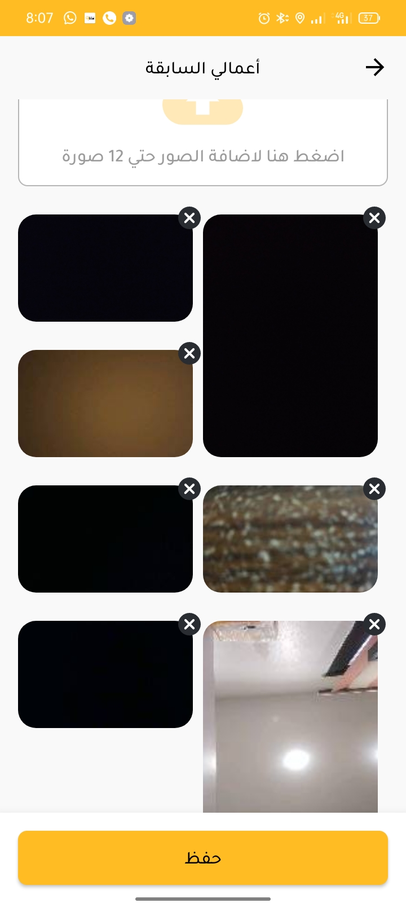
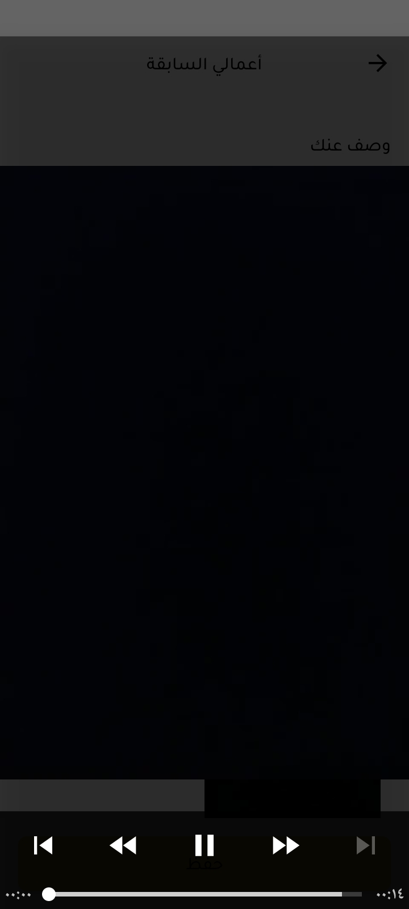
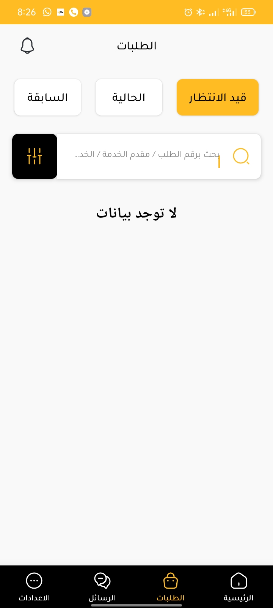
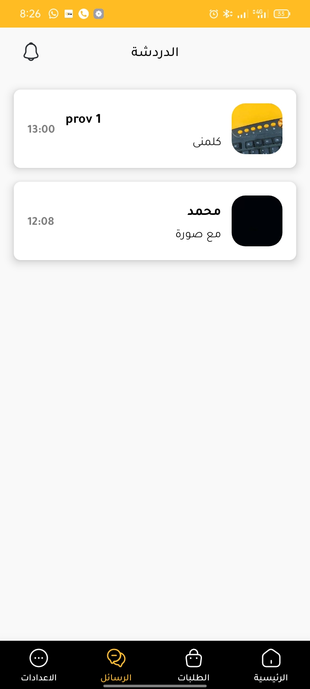
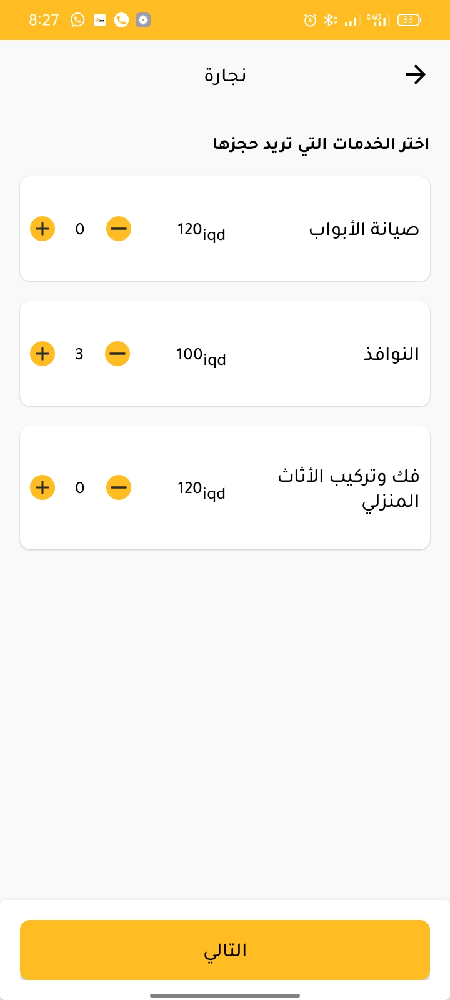
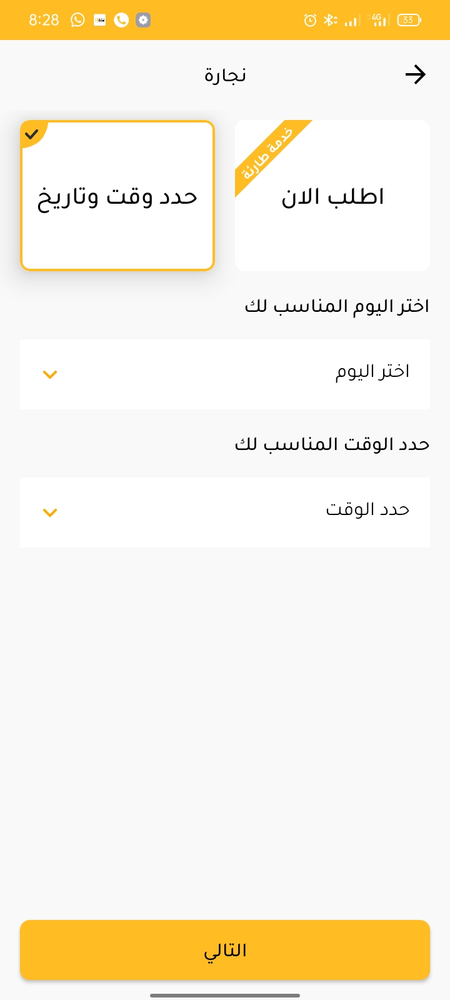
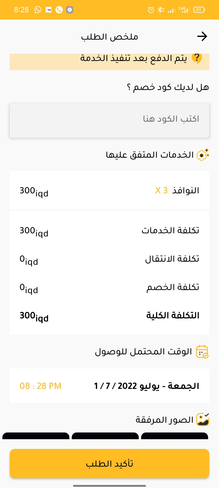

# About the Code

- Multi modules used in this project to produce 2 Apps so I used 3 modules firstly the core library module to share common resources & classes secondly the user application module used to represent the 1st App and finally another application module used to represent the 2nd App.
- Pusher was used (Beams & Channels) to deliver notifications & real-time communications.
- Code hasn't been published as it's private to the company I'm working with, I just published the images to showcase my work

## Images from the App

### Provider App

 

 

 

### User App

 

 

 

